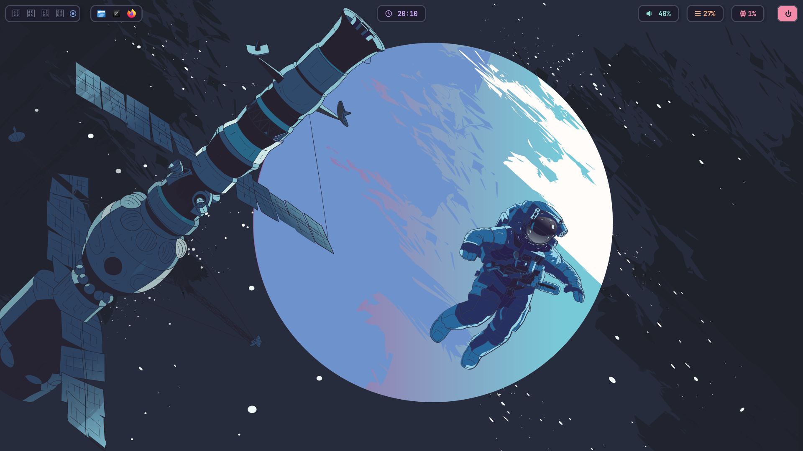
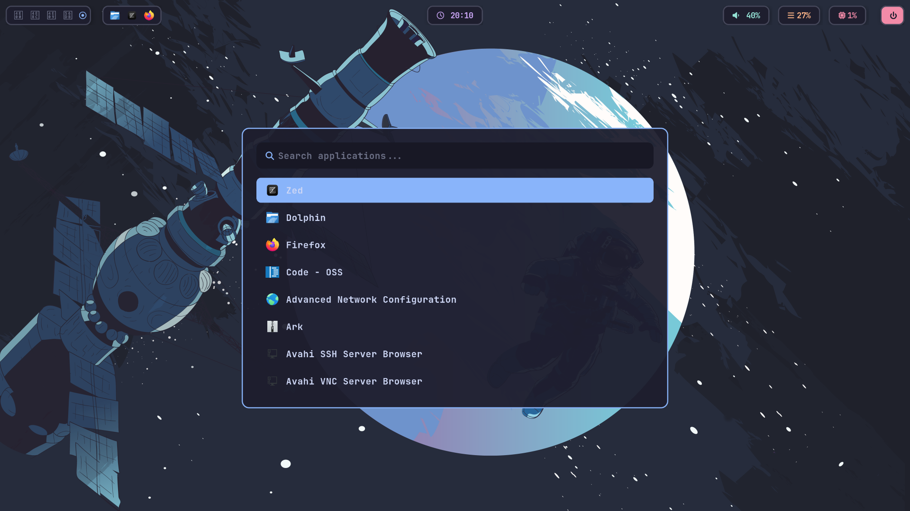

# 🌌 My Arch Dotfiles


> **"Code in style."** > My personal, modular, and high-performance Hyprland configuration for Web Development. Built on Arch Linux.

---

## 🖼️ Preview
*(Add your screenshots here! Take a picture of your desktop with `Super+Shift+S` and upload it to the repo)*

| Clean Desktop | Workflow |
| :---: | :---: |
|  |  |

---

## 🛠️ Tech Stack

| Component | Tool | Description |
| --- | --- | --- |
| **OS** | Arch Linux | The base foundation |
| **WM** | Hyprland | Tiling Wayland Compositor |
| **Bar** | Waybar | Floating "Pill" design with Anime/Kanji workspaces |
| **Terminal** | Kitty | GPU-accelerated, infinite scrollback |
| **Shell** | Bash + Starship | Pastel Powerline preset |
| **Launcher** | Rofi (Wayland) | VS Code Command Palette style |
| **Notifications** | Dunst | Floating "Glass" cards |
| **Lock Screen** | Hyprlock | Cyberpunk aesthetic with blur |
| **Idle Daemon** | Hypridle | Auto-lock and suspend logic |
| **Theme** | Catppuccin Mocha | Mauve/Blue gradient accents |

---

## ✨ Key Features

* **Modular Architecture:** Configs are split into logical files (`rules.conf`, `animations.conf`, `keybinds.conf`) for easy maintenance.
* **Web Dev Optimized:** * Preserves Workspace 3 specifically for VS Code/Zed.
    * Docker & Node.js (`fnm`) ready.
    * 10,000 lines of terminal scrollback for debugging.
* **Floating Aesthetics:** Waybar and Dunst are designed to look like floating islands rather than static bars.
* **Glitch-Free:** Specific window rules to prevent flickering on popups and notifications.
* **Instant Feedback:** `Super + Shift + B` instantly reloads the bar for rapid CSS prototyping.

---

## ⌨️ Keybindings

**Modifier Key:** `SUPER` (Windows Key)

| Key | Action |
| --- | --- |
| `Super + Return` | Open Terminal (Kitty) |
| `Super + E` | Open File Manager (Dolphin) |
| `Super + Alt + Space` | App Launcher (Rofi) |
| `Super + Q` | Close Active Window |
| `Super + F` | Toggle Fullscreen |
| `Super + V` | Clipboard History (Cliphist) |
| `Super + S` | Screenshot Region (Swappy) |
| `Super + L` | Lock Screen |
| `Super + Shift + B` | Reload Waybar |
| `Super + M` | **Logout / Exit Hyprland** |

---

## 🚀 Installation

### 1. The Essentials
Ensure you have the required packages installed on Arch Linux:

```bash
# Core components
sudo pacman -S hyprland waybar dunst rofi-wayland kitty starship hyprpaper

# Utilities
sudo pacman -S grim slurp swappy cliphist wl-clipboard

# Fonts (Critical for icons)
sudo pacman -S ttf-jetbrains-mono-nerd noto-fonts-emoji

# Extras
sudo pacman -S hyprlock hypridle

```
### 2. Deployment

Clone this repository directly into your config directory:

```bash

# Backup existing config if necessary
mv ~/.config ~/.config.bak

# Clone repo
git clone [https://github.com/SOLOxLEVELING/dotfiles.git](https://github.com/SOLOxLEVELING/dotfiles.git) ~/.config

# Make scripts executable
chmod +x ~/.config/waybar/launch.sh

```
### 3. Finalize

Reboot or log out, then select Hyprland at the login screen.

```bash

📂 Structure

~/.config/
├── hypr/
│   ├── hyprland.conf      # Entry point
│   ├── animations.conf    # Bezier curves & motion
│   ├── keybinds.conf      # Shortcut definitions
│   ├── rules.conf         # Window & Workspace rules
│   └── themes/            # Color palettes
├── waybar/
│   ├── config.jsonc       # Bar layout & modules
│   └── style.css          # CSS Styling
├── kitty/                 # Terminal settings
├── rofi/                  # Launcher theme
└── dunst/                 # Notification styling

```

### 🤝 Credits

    Hyprland Community for the amazing compositor.

    Catppuccin for the soothing color palette.

    Adnan (Addy) - Creator
