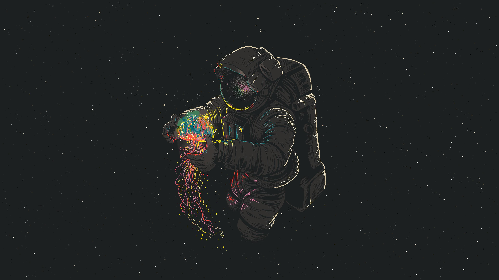

# My Arch Linux Dotfiles


A dynamic, multi-theme, and performance-oriented Hyprland setup for Arch Linux, designed for developers and aesthetics enthusiasts. Switch between your favorite color schemes on the fly.

> **Note**: This rice uses **swaync** for notifications (not dunst). While dunst config is included for reference, swaync is the active notification daemon.

---

## Gallery

|                  Catppuccin                   |                 Dracula                 |                 Gruvbox                 |
| :-------------------------------------------: | :-------------------------------------: | :-------------------------------------: |
|  |  |  |

|               Nord                |               OLED                |
| :-------------------------------: | :-------------------------------: |
|  |  |

---

## Key Features

- **Dynamic Theming**: Switch between multiple themes (`Catppuccin`, `Dracula`, `Gruvbox`, `Nord`, `OLED`) instantly using a Rofi menu. The script updates colors for Hyprland, Waybar, Kitty, Rofi, and swaync.
- **Modular Architecture**: Configurations are neatly organized into separate files for easy management of `settings`, `keybindings`, `autostart`, and more.
- **Developer-Focused**: Pre-configured for web development with specific workspace assignments and generous terminal scrollback.
- **Floating Aesthetics**: A modern desktop experience with a floating Waybar and styled notifications via swaync.
- **Performance-Tuned**: Optimized for a smooth and responsive experience on Wayland.

---

## Tech Stack

| Component         | Tool            | Description                                           |
| ----------------- | --------------- | ----------------------------------------------------- |
| **OS**            | Arch Linux      | The foundational operating system.                    |
| **WM**            | Hyprland        | A dynamic tiling Wayland compositor.                  |
| **Bar**           | Waybar          | A highly customizable Wayland bar.                    |
| **Terminal**      | Kitty           | A fast, feature-rich, GPU-based terminal.             |
| **Shell**         | Bash + Starship | A minimal, fast, and infinitely customizable prompt.  |
| **Launcher**      | Rofi            | A versatile application launcher and window switcher. |
| **Notifications** | swaync          | A GTK-based notification daemon with control center.  |
| **Logout Menu**   | wlogout         | A Wayland-based logout menu.                          |
| **Lock Screen**   | Hyprlock        | A sleek and fast screen locker for Wayland.           |
| **Idle Daemon**   | Hypridle        | For screen locking and idle management.               |
| **Wallpaper**     | Hyprpaper       | A fast wallpaper utility for Hyprland.                |

---

## Installation

### Prerequisites

Ensure you have a fresh Arch Linux installation with:

- A working internet connection
- An AUR helper installed (`yay` or `paru`)
- Base development tools: `sudo pacman -S base-devel git`

### 1. Install Dependencies

#### Official Packages (pacman)

```bash
# Core Wayland & Hyprland components
sudo pacman -S hyprland hyprpaper hyprlock hypridle hyprpolkitagent

# Bar & Launcher
sudo pacman -S waybar rofi-wayland

# Terminal & Shell
sudo pacman -S kitty starship

# Clipboard & Screenshot utilities
sudo pacman -S grim slurp swappy cliphist wl-clipboard

# Fonts (essential for icons)
sudo pacman -S ttf-jetbrains-mono-nerd noto-fonts-emoji

# System utilities
sudo pacman -S playerctl brightnessctl network-manager-applet

# File manager (optional, but referenced in keybinds)
sudo pacman -S thunar
```

#### AUR Packages (using yay)

```bash
# Notification daemon (swaync, NOT dunst)
yay -S swaync

# Logout menu
yay -S wlogout
```

#### GTK Theming (optional but recommended)

```bash
# Install GTK theme and icons
yay -S catppuccin-gtk-theme-mocha papirus-icon-theme

# Apply the theme (this is also done at startup via autostart.conf)
gsettings set org.gnome.desktop.interface gtk-theme "Catppuccin-Mocha-Standard-Blue-Dark"
gsettings set org.gnome.desktop.interface icon-theme "Papirus-Dark"
gsettings set org.gnome.desktop.interface font-name "JetBrainsMono Nerd Font 11"
```

### 2. Deploy Dotfiles

#### Option A: Clone as ~/.config (Simple)

```bash
# Backup your existing config
mv ~/.config ~/.config.bak

# Clone the repository
git clone https://github.com/SOLOxLEVELING/dotfiles.git ~/.config

# Make scripts executable
chmod +x ~/.config/hypr/scripts/*.sh
chmod +x ~/.config/waybar/launch.sh
```

#### Option B: Symlink Method (Recommended for version control)

```bash
# Clone to your preferred location
git clone https://github.com/SOLOxLEVELING/dotfiles.git ~/dotfiles

# Create symlinks for each component
ln -sf ~/dotfiles/hypr ~/.config/hypr
ln -sf ~/dotfiles/waybar ~/.config/waybar
ln -sf ~/dotfiles/kitty ~/.config/kitty
ln -sf ~/dotfiles/rofi ~/.config/rofi
ln -sf ~/dotfiles/swaync ~/.config/swaync
ln -sf ~/dotfiles/wlogout ~/.config/wlogout
ln -sf ~/dotfiles/starship.toml ~/.config/starship.toml

# Make scripts executable
chmod +x ~/dotfiles/hypr/scripts/*.sh
chmod +x ~/dotfiles/waybar/launch.sh
```

### 3. Setup SDDM (Login Screen)

#### Since SDDM themes reside in the system folder (/usr/share/sddm/themes), they cannot be symlinked. I have included a one-click installer script to set this up.

```bash
# 1. Ensure you have a profile picture at ~/.face.icon (Optional)
# cp /home/addy/dotfiles/sddm/themes/catppuccin/icons/.face.icon ~/.face.icon

# 2. Run the installer script
~/dotfiles/sddm/install.sh

# 3. Enable SDDM service
sudo systemctl enable sddm
```

### 4. Finalize

1. **Logout** from your current session
2. **Select Hyprland** from your display manager (SDDM, GDM, etc.)
3. **Login** and enjoy your new rice!

---

## Usage

### Theme Switching

Press `Super + T` to open the theme selection menu. Choose your desired theme, and the entire desktop environment will update to the new color scheme.

### Keybindings

**Modifier Key**: `SUPER` (Windows Key)

| Key                        | Action                         |
| -------------------------- | ------------------------------ |
| `Super + Return`           | Open Terminal (Kitty)          |
| `Super + Q`                | Close Active Window            |
| `Super + M`                | Exit Hyprland Session          |
| `Super + E`                | Open File Manager              |
| `Super + T` or `Super + K` | **Open Theme Switcher**        |
| `Super + Alt + Space`      | App Launcher (Rofi)            |
| `Super + V`                | Clipboard History (Cliphist)   |
| `Super + S`                | Screenshot (Select Area)       |
| `Super + Shift + S`        | Screenshot (Full Screen)       |
| `Super + L`                | Lock Screen                    |
| `Super + F`                | Open Browser                   |
| `Super + Z`                | Open IDE                       |
| `Super + Shift + B`        | Reload Waybar                  |
| `Super + [0-9]`            | Switch to Workspace [0-9]      |
| `Super + Shift + [0-9]`    | Move Window to Workspace [0-9] |
| `Super + Arrows`           | Move Focus                     |

---

## Directory Structure

```
dotfiles/
├── hypr/                       # Hyprland configuration
│   ├── hyprland.conf           # Main config entry point
│   ├── animations.conf         # Animation settings
│   ├── autostart.conf          # Startup applications
│   ├── env.conf                # Environment variables
│   ├── hypridle.conf           # Idle daemon config
│   ├── hyprlock.conf           # Lock screen config
│   ├── hyprpaper.conf          # Wallpaper config
│   ├── input.conf              # Input device settings
│   ├── keybinds.conf           # Keybindings
│   ├── monitors.conf           # Monitor configuration
│   ├── programs.conf           # Default programs
│   ├── rules.conf              # Window rules
│   ├── settings.conf           # General settings
│   ├── scripts/                # Utility scripts
│   │   ├── theme-switcher.sh   # Main theme engine
│   │   ├── rofi-theme-menu.sh  # Rofi menu for themes
│   │   └── theme-restore.sh    # Restore theme on login
│   ├── themes/                 # Theme color definitions
│   └── wallpapers/             # Theme wallpapers
├── waybar/                     # Status bar
│   ├── config.jsonc            # Bar layout & modules
│   ├── style.css               # Main styling
│   ├── colors.css              # Current theme colors
│   ├── launch.sh               # Waybar launcher script
│   └── themes/                 # Theme-specific CSS
├── kitty/                      # Terminal emulator
│   ├── kitty.conf              # Terminal config
│   └── themes/                 # Terminal color themes
├── rofi/                       # Application launcher
│   ├── config.rasi             # Rofi config
│   └── themes/                 # Launcher themes
├── swaync/                     # Notification daemon (ACTIVE)
│   ├── config.json             # Notification settings
│   ├── style.css               # Main styling
│   └── themes/                 # Notification themes
├── wlogout/                    # Logout menu
│   ├── layout                  # Menu layout
│   ├── style.css               # Styling
│   └── themes/                 # Theme variants
├── starship/                   # Shell prompt themes
│   └── themes/                 # Prompt color themes
├── starship.toml               # Starship prompt config
└── dunst/                      # (Legacy - not actively used)
    └── dunstrc                 # Dunst config for reference
```

---

## Troubleshooting

### Notifications not working?

- Ensure **swaync** is installed: `yay -S swaync`
- Kill any dunst process: `pkill dunst`
- Start swaync manually: `swaync &`

### Waybar not appearing?

- Check if waybar is installed: `which waybar`
- Run launch script manually: `~/.config/waybar/launch.sh`

### Theme not applying correctly?

- Ensure scripts are executable: `chmod +x ~/.config/hypr/scripts/*.sh`
- Run theme restore: `~/.config/hypr/scripts/theme-restore.sh`

### Missing icons in Waybar?

- Install the Nerd Font: `sudo pacman -S ttf-jetbrains-mono-nerd`
- Restart Waybar: `Super + Shift + B`

### Hyprpaper/Wallpaper issues?

- Check hyprpaper is running: `pgrep hyprpaper`
- Verify wallpaper path in `hypr/hyprpaper.conf`

---

## Post-Installation Checklist

- [ ] All packages installed (pacman + AUR)
- [ ] Dotfiles cloned/symlinked to `~/.config`
- [ ] Scripts are executable (`chmod +x`)
- [ ] GTK theme and icons applied
- [ ] Logged into Hyprland session
- [ ] Theme switcher working (`Super + T`)
- [ ] Notifications displaying properly (swaync)
- [ ] Waybar visible and functional
- [ ] Screenshot tools working

---

## Credits

- The Hyprland community for their work on the compositor
- The creators of the color schemes: Catppuccin, Dracula, Gruvbox, and Nord
- [swaync](https://github.com/ErikReider/SwayNotificationCenter) for the notification daemon
- Adnan (Addy) - Creator
